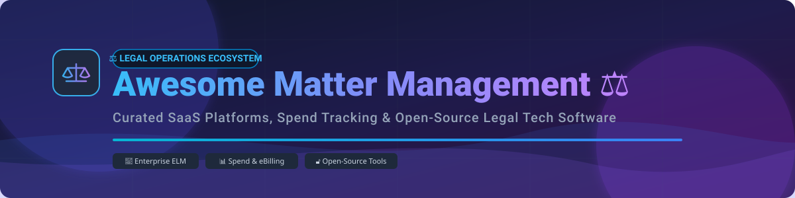

# Awesome Matter Management ⚖️



<p align="center">
  <a href="https://github.com/ishandutta2007/Awesome-Awesome-Awesome"></a><a href="https://discord.gg/jc4xtF58Ve"></a>
  <a href="https://github.com/ishandutta2007/Awesome-Matter-Management/stargazers"></a>
  <a href="https://github.com/ishandutta2007/Awesome-Matter-Management/network/members"></a>
  <a href="https://github.com/ishandutta2007/Awesome-Matter-Management/LICENSE"></a>
  <a href="https://github.com/ishandutta2007"></a>
</p>

## 🚀 Top Legal Matter Management Platforms & Software Ecosystem

Welcome to the definitive, curated directory of **Legal Matter Management Platforms**, Enterprise Legal Management (ELM) software, outside-counsel spend tracking tools, LEDES eBilling engines, and self-hosted open-source case management systems.

Whether you are an in-house legal operations leader optimizing corporate spend or a law firm administrator looking for practice management solutions, this guide tracks market leaders, pricing structures, enterprise valuations, and community-driven open-source alternatives.

---

## 📌 Table of Contents

- [📊 Sector Overview & Market Size](#-sector-overview--market-size)
- [💼 Top SaaS & Hosted Enterprise Platforms](#-top-saas--hosted-enterprise-platforms)
- [🔓 Open-Source GitHub Projects & Self-Hosted Software](#-open-source-github-projects--self-hosted-software)
- [💡 Architectural Frameworks for Custom Legal Tech](#-architectural-frameworks-for-custom-legal-tech)
- [🤝 How to Contribute](#-how-to-contribute)
- [☕ Support & Community](#-support--community)
- [📈 Star History](#-star-history)
- [⚠️ Disclaimer](#%EF%B8%8F-disclaimer)

---

## 📊 Sector Overview & Market Size

> 💡 **Market Size & Fragment Analysis**: The Global Enterprise Legal Management (ELM) & Legal Matter Management market was estimated at **~$3.8 Billion in 2025** and is projected to reach **~$7.2 Billion by 2032** (growing at a ~9.5% CAGR). The sector is **moderately fragmented**: consolidated enterprise giants (like Thomson Reuters and Mitratech) capture the upper-tier corporate enterprise market, while a dynamic layer of specialized SaaS startups and vertical practice tools serve mid-market corporate legal departments and law firms.

---

## 💼 Top SaaS & Hosted Enterprise Platforms

The table below summarizes commercial matter management, spend tracking, and legal operations platforms, sorted by estimated company size (market valuation / revenue scale, descending).

| Product | Description | Estimated Size (Valuation / Revenue) | Starting Pricing Tier | Free Tier Limit / Free Trial |
| :--- | :--- | :--- | :--- | :--- |
| **[Legal Tracker (Thomson Reuters)](https://legal.thomsonreuters.com/)** | Enterprise matter and spend management solution with analytics, eBilling, and LEDES invoice processing. | **~$44 Billion** (Parent Market Cap) | Custom Enterprise Quote (~$15,000/yr starting base) | ❌ No free tier; demo available upon sales request. |
| **[HighQ (Thomson Reuters)](https://legal.thomsonreuters.com/)** | Secure legal collaboration and workspace platform for matter-centric workflows and client portals. | **~$44 Billion** (Parent Market Cap) | ~$35 per user/month (Enterprise billing) | ❌ No free tier; customized enterprise demo only. |
| **[Mitratech TeamConnect](https://mitratech.com/)** | Configurable enterprise legal management platform for corporate legal departments, spend control, and compliance. | **~$2.5 Billion** (PE Valuation) | ~$25,000/year base contract | ❌ No free tier; 14-day guided corporate sandbox upon request. |
| **[Onit](https://www.onit.com/)** | Enterprise legal workflow automation, matter management, and operational business process platform. | **~$1.2 Billion** (PE Valuation) | ~$20,000/year enterprise package | ❌ No free tier; interactive product demo available. |
| **[Actionstep](https://www.actionstep.com/)** | Cloud practice and matter management platform for law firms covering workflow, billing, and accounting. | **~$250 Million** (PE Valuation) | **$69 per user/month** (Express Plan, billed annually) | ❌ No free tier; **14-day free trial** available. |
| **[SimpleLegal](https://www.simplelegal.com/)** | In-house legal operations and matter management solution (acquired by Onit / K1 Investment Management). | **~$200 Million** (Acquisition Valuation) | ~$800/month (~$9,600/yr starting team tier) | ❌ No free tier; scheduled live demo on request. |
| **[LawVu](https://lawvu.com/)** | All-in-one legal workspace for in-house legal teams unifying matters, contracts, intake, and spend. | **~$150 Million** (VC Valuation) | **$12,000/year** (Standard Tier for In-House teams) | ❌ No free tier; **14-day trial** / sandbox demo. |
| **[Brightflag](https://www.brightflag.com/)** | AI-assisted legal spend management and matter tracking platform with automated invoice review. | **~$120 Million** (VC Valuation) | ~$10,000/year base subscription | ❌ No free tier; personalized trial & demo on request. |
| **[BusyLamp](https://www.busylamp.com/)** | European legal spend and matter management software focused on eBilling and vendor management (acquired by Onit). | **~$80 Million** (Acquisition Value) | €600/month starting base | ❌ No free tier; sales demo upon request. |
| **[Checkbox](https://www.checkbox.ai/)** | No-code legal workflow automation and intake platform for routing matters and approvals. | **~$50 Million** (VC Valuation) | **$500/month** (Starter automation tier) | ❌ No free tier; **14-day free trial** upon application. |
| **[Docketwise](https://www.docketwise.com/)** | Immigration practice and legal matter management software for case tracking, forms, and client portals. | **~$35 Million** (Estimated Valuation) | **$69 per user/month** (Standard Plan) | ❌ No free tier; **7-day free trial** (full feature access). |
| **[CARET Legal](https://caretlegal.com/)** | Practice and matter management suite designed for growing law firms with integrated billing. | **~$30 Million** (Estimated Valuation) | **$79 per user/month** (Enterprise Tier, billed annually) | ❌ No free tier; **7-day free trial** available. |
| **[CaseFox](https://www.casefox.com/)** | Legal practice, time-tracking, LEDES billing, and matter management software. | **~$10 Million** (Estimated Valuation) | **$39 per user/month** (Pro Plan) | 🎁 **Free Plan Forever**: Up to 4 active cases/matters & 1 user. |

---

## 🔓 Open-Source GitHub Projects & Self-Hosted Software

Below is a curated list of open-source legal matter management systems, case trackers, ERP extensions, and workflow engines sorted by GitHub Stars_Count (descending).

| Project & Repo Link | Stars_Count Badge | Description | Primary Tech Stack |
| :--- | :--- | :--- | :--- |
| **[Odoo Legal & Project Modules](https://github.com/odoo/odoo)** | [](https://github.com/odoo/odoo/stargazers) | Open-source enterprise management software with customizable project & matter tracking modules. | Python, JavaScript |
| **[ERPNext Legal & Project Management](https://github.com/frappe/erpnext)** | [](https://github.com/frappe/erpnext/stargazers) | Flexible open-source ERP framework configurable for matter workflows, timekeeping, and client invoicing. | Python, JS, MariaDB |
| **[Documenso](https://github.com/documenso/documenso)** | [](https://github.com/documenso/documenso/stargazers) | Open-source document signing framework for matter intake agreements, retainers, and legal contracts. | TypeScript, Next.js |
| **[Formbricks](https://github.com/formbricks/formbricks)** | [](https://github.com/formbricks/formbricks/stargazers) | Open-source survey & intake form engine suitable for legal matter intake routing and client feedback. | TypeScript, React |
| **[Stella Workspace](https://github.com/stll-dev/stll)** | [](https://github.com/stll-dev/stll/stargazers) | Emerging open-source legal workspace focused on matter documents, collaboration, and AI document review. | TypeScript, React |
| **[OpenLawOffice](https://github.com/NodineLegal/OpenLawOffice)** | [](https://github.com/NodineLegal/OpenLawOffice/stargazers) | Open-source law office management solution including case tracking, LEDES-compatible billing, and tasking. | C#, ASP.NET, SQL Server |
| **[LawLink](https://github.com/lawflow-boop/LawLink)** | [](https://github.com/lawflow-boop/LawLink/stargazers) | Self-hosted case & practice management system for solo lawyers and small firms covering matters, tasks, and deadlines. | PHP, JavaScript |

---

## 💡 Architectural Frameworks for Custom Legal Tech

For technical legal ops teams building bespoke internal matter trackers:

```
[ Client / Corporate Intake Form ]
              │
              ▼
[ Automated Intake Routing (Checkbox / Formbricks) ]
              │
              ▼
[ Core Matter Management Database (LawLink / ERPNext / Stella) ]
              │
    ┌─────────┴─────────┐
    ▼                   ▼
[ Document Vault ]  [ LEDES eBilling & Spend Engine ]
```

1. **Intake Capture**: Standardize incoming legal requests via self-hosted forms or no-code engines.
2. **Matter Records**: Maintain single-source-of-truth case state in a relational database or open ERP.
3. **Spend Escalation**: Route complex LEDES eBilling and high-volume outside counsel spend to commercial enterprise platforms (e.g., Legal Tracker, TeamConnect) when enterprise LEDES validation is required.

---

## 🤝 How to Contribute

Contributions are welcome! To contribute:

1. Fork this repository 🍴
2. Create your feature branch (`git checkout -b feature/new-matter-tool`)
3. Add your tool to `README.md` following the exact table structure.
4. Open a Pull Request with a clear summary of your additions 🚀

For awesome list formatting standards, check out [Awesome List Guidelines](https://github.com/ishandutta2007/Awesome-Awesome-Awesome).

---

## ☕ Support & Community

If you find this legal matter management directory useful, please consider supporting the project:

- ⭐ **Star this repository** on GitHub to help others discover it!
- 🔀 **Fork & Share** it with legal operations colleagues, in-house teams, and legal engineers.
- 💬 Join our discussion on [Discord](https://discord.gg/jc4xtF58Ve)!
- 💖 Sponsor the maintainer via the [GitHub Sponsor Dashboard](https://github.com/sponsors/ishandutta2007).

---

## 📈 Star History

[](https://star-history.dera.page/#ishandutta2007/Awesome-Matter-Management&type=date&legend=top-left)

---

## ⚠️ Disclaimer

- This repository contains a **community-curated list** for informational and educational purposes only.
- Legal matter systems handle confidential, privileged, and sensitive corporate data. Deploying self-hosted or open-source software requires strict security audits, access control configurations, and professional responsibility compliance.
- Inclusion in this list does not constitute an endorsement or warranty.
